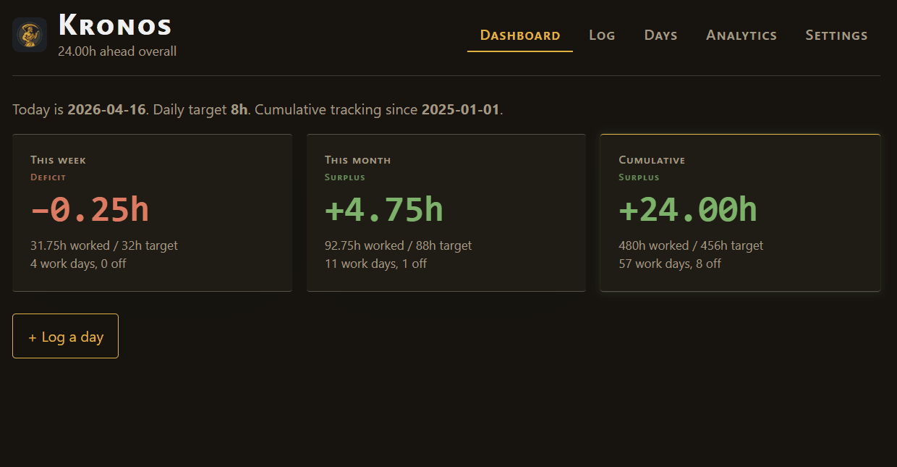

# Kronos ⏱️

> A self-hosted work-hours tracker for people who don't want to open a spreadsheet every morning.

Single-user. No auth. SQLite-backed. Runs as a Docker container behind your own reverse proxy.

[](LICENSE)
[](https://www.python.org/)
[](https://fastapi.tiangolo.com/)



---

## What it does

Log your working days in seconds. Kronos keeps a running tab of where you stand — this week, this month, all time — against a configurable daily target.

- **One row per day** — `work` / `vacation` / `sick` / `holiday`
- **Work days** have start/end times and any number of break entries
- **Weekly, monthly, and cumulative surplus/deficit** computed against your target (default 8 h/day)
- **Non-work days** automatically zero out that day's target — the period totals adjust accordingly
- **PWA-ready** — install it on your phone or desktop from the browser menu

---

## Stack

| Layer | Tech |
|---|---|
| Backend | FastAPI + SQLAlchemy 2 + Alembic |
| Frontend | Jinja2 + Alpine.js + Pico CSS + Chart.js |
| Storage | Single SQLite file (WAL mode) in a Docker volume |
| Vendored | All JS/CSS bundled — **zero build step** |

---

## Quick start

### Docker (recommended)

```sh
git clone https://github.com/Loadge/kronos.git
cd kronos
docker compose up -d
```

Open **http://localhost:8765**.

First boot runs `alembic upgrade head` automatically and seeds default settings.

#### Reverse proxy

Point your reverse proxy at `http://<host>:8765`. Example Nginx snippet:

```nginx
location / {
    proxy_pass         http://127.0.0.1:8765;
    proxy_set_header   Host $host;
    proxy_set_header   X-Real-IP $remote_addr;
    proxy_set_header   X-Forwarded-For $proxy_add_x_forwarded_for;
    proxy_set_header   X-Forwarded-Proto $scheme;
}
```

Works with NGINX Proxy Manager, Caddy, Traefik, etc.

#### Port & timezone

```env
# .env next to docker-compose.yml
APP_PORT=8765          # host port
TZ=Europe/London       # drives what "today" means in the dashboard
```

### Local development

Requires Python 3.12+.

```sh
make install          # pip install -r requirements-dev.txt
make migrate          # alembic upgrade head
make seed             # ~3 months of realistic sample data
make run              # uvicorn on :8765 with --reload
```

---

## Configuration

| Env var | Default | Notes |
|---|---|---|
| `APP_PORT` | `8765` | Internal + published port |
| `TZ` | `UTC` | Drives what "today" means in the dashboard |
| `KRONOS_DATA_DIR` | `/app/data` (container) / `./data` (local) | Where `kronos.db` lives |
| `DATABASE_URL` | derived from `KRONOS_DATA_DIR` | Full override for the SQLAlchemy URL |

Runtime-editable settings (via the Settings tab or `PUT /api/config`):

| Setting | Default | Notes |
|---|---|---|
| `daily_target_hours` | `8.0` | Your contracted hours per work day |
| `cumulative_start_date` | `2025-01-01` | Start of the all-time running total |

These live in the `settings` table; the migration seeds defaults on first boot.

---

## Data & backups

The SQLite file lives at **`/app/data/kronos.db`** inside the container, bound to the **`kronos-data`** named Docker volume.

**Export from the UI** — Settings tab → *Download backup* — produces a portable JSON file that can be imported back with *Restore from file*.

**One-shot host-side copy:**
```sh
docker run --rm -v kronos-data:/data -v "$PWD":/out alpine \
  sh -c 'cp /data/kronos.db /out/kronos-$(date +%F).db'
```

> WAL is checkpointed by SQLite on connection close. For a tighter guarantee, stop the container before copying.

---

## API

Interactive docs at `/docs` (FastAPI Swagger UI) once the container is running.

| Method & path | Purpose |
|---|---|
| `POST /api/entries` | Create a day entry (with breaks) |
| `GET /api/entries?from=&to=` | List entries, optional date range |
| `GET /api/entries/{date}` | Single entry |
| `PUT /api/entries/{date}` | Full replace (atomic break-set replace) |
| `DELETE /api/entries/{date}` | Delete entry (cascades breaks) |
| `GET /api/dashboard?today=` | Week + month + cumulative summary |
| `GET /api/analytics/cumulative?as_of=` | Point-in-time surplus/deficit |
| `GET /api/analytics/monthly` | One row per calendar month |
| `GET /api/analytics/records` | Longest day, most surplus month, etc. |
| `GET /api/export.csv` | Download CSV |
| `GET /api/export.json` | Download JSON |
| `GET /api/config` / `PUT /api/config` | Read/write daily target + cumulative start date |
| `GET /api/backup` | Download full JSON backup (entries + settings) |
| `POST /api/restore` | Restore from JSON backup (wipes existing data first) |
| `DELETE /api/data` | Wipe all entries (admin / testing) |
| `GET /healthz` | Container healthcheck |

---

## Tests

```sh
make test             # pytest — in-memory SQLite, no container needed
make lint             # ruff check + format check
```

| Suite | Coverage |
|---|---|
| **Unit** | Net-hours math, break-calc conversions, ISO-week/month boundaries, `DayType` enum, `WorkEntry` properties, settings service |
| **API** | Every endpoint — happy path + validation errors (duplicate date, end ≤ start, break > span, day-type transitions) |
| **Integration** | Full CRUD flows, dashboard recalculation after state changes, cross-month weeks, export round-trips |
| **Regression** | Cumulative start-date boundary, `as_of` inclusive semantics, float precision, backup field fidelity, orphaned-break FK fix, non-work day zero-target invariant, CSV quoting |

### E2E — Playwright

End-to-end tests spin up a real uvicorn server and drive a real browser. Excluded from the default `make test` run.

```sh
pip install pytest-playwright
playwright install chromium

pytest tests/e2e -v            # headless
pytest tests/e2e -v --headed   # visible browser
```

---

## Security posture

Kronos is designed for a **trusted internal network** (behind a VPN or a private reverse proxy):

- **No auth layer** — access control is the network itself
- **No cookies** — no CSRF surface to defend
- **JSON-only mutation API** with Pydantic strict validation on every field
- Container runs as a **non-root user** (`kronos`, uid 1000)
- Uvicorn runs with `--proxy-headers` so the real client IP surfaces in logs behind a proxy

> ⚠️ If you ever expose this to the open internet, add an auth layer (e.g. Cloudflare Access, Authelia, or Basic Auth in your reverse proxy) — the app itself has no authentication.

---

## Migrations

```sh
make migrate                           # apply pending migrations
make revision MSG="add new column"     # generate a new autogenerated migration
```

Alembic runs with `render_as_batch=True` so SQLite-unfriendly `ALTER TABLE` operations (drop column, alter type) work correctly.

---

## Layout

```
kronos/
├── backend/
│   ├── app/
│   │   ├── routers/      # entries, analytics, export, config, backup, admin
│   │   ├── services/     # computations, settings, views
│   │   └── templates/    # Jinja2 shell + tab partials
│   ├── static/           # app.js, styles.css, sw.js, manifest.json, icon.png, vendor/*
│   └── seed.py           # realistic sample-data generator
├── alembic/              # migrations + env.py
├── tests/
│   ├── unit/             # pure-function tests (no DB)
│   ├── api/              # per-router HTTP tests (in-memory SQLite)
│   ├── integration/      # cross-endpoint flows + regression suite
│   └── e2e/              # Playwright browser tests
├── deploy.sh             # one-command deploy to a remote Docker host via SSH
├── Dockerfile            # multi-stage: base → test → runtime
├── docker-compose.yml
├── entrypoint.sh         # alembic upgrade head + uvicorn
├── Makefile
└── pyproject.toml        # ruff + pytest config
```

---

## License

[MIT](LICENSE)
