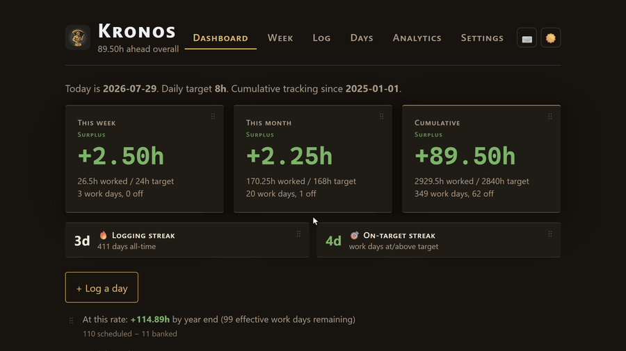

# Kronos ⏱️

> A self-hosted work-hours tracker for people who don't want to open a spreadsheet every morning.

Single-user. No auth. One SQLite file. Runs as a Docker container behind your own reverse proxy.

[](LICENSE)
[](https://www.python.org/)
[](https://fastapi.tiangolo.com/)
[](#tests)



---

## The idea

You have a contracted number of hours per day. Some days you work more, some less. Kronos
answers one question — **am I ahead or behind, and by how much?** — for this week, this month,
and every day since you started tracking.

Log a day in a few seconds, then get out of the way.

---

## Features

### Logging

- **One row per date.** Every day is `work`, `vacation`, `sick`, `holiday`, or `flex`
- **Work days** carry a start time, an end time, and any number of breaks — entered as a
  time range or as raw minutes
- **Clock in / clock out** stamps the current time into the form, for logging as you go
- **Bulk logging** applies one non-work type across a whole date range in a single call
- **Day templates** stored server-side — one click fills a recurring shift
- **Public holiday import** by country and region, with a preview before anything is written
  (via [Nager.Date](https://date.nager.at/))
- **Free-text notes** per day, searchable across all entries

### The numbers

- **Week, month, and cumulative surplus/deficit** against your daily target
- **Year-over-year** — this year against the same period last year
- **Date-effective daily target.** If your contract changed mid-year, the target is a timeline,
  not a single number: every day is measured against the target in force *on that date*, so
  cumulative totals spanning the change stay correct
- **Non-work days zero out that day's target**, so period totals adjust on their own. `flex`
  days are the exception — they still charge the target, draining the surplus you banked
- **Vacation budget** tracking against an annual allowance
- **Analytics tab** — point-in-time balance, cumulative trend chart, monthly and yearly
  breakdowns, records (longest day, best month, best/worst year), a year-at-a-glance heatmap,
  and average surplus per weekday

### The app itself

- **Draggable dashboard** — reorder the summary cards, streak tiles, and forecast/quick-log
  blocks; the layout persists server-side, not in your browser
- **Logging and on-target streaks**, with milestone toasts at 30 / 100 / 365 days
- **Week view** for the current week at a glance; **Log** tab driven by a calendar picker;
  **Days** tab for the full searchable history
- **Command palette** (<kbd>.</kbd>), keyboard shortcuts, dark and light themes
- **PWA-installable**, with a service worker for the app shell
- **CSV import/export** and full JSON backup/restore

### Keyboard

| Key | |
|---|---|
| <kbd>W</kbd> <kbd>L</kbd> <kbd>D</kbd> <kbd>A</kbd> <kbd>S</kbd> | Week · Log · Days · Analytics · Settings |
| <kbd>.</kbd> | Command palette |
| <kbd>Ctrl</kbd>+<kbd>Enter</kbd> | Save the current form |
| <kbd>Esc</kbd> | Dismiss / back out |

---

## Stack

| Layer | Tech |
|---|---|
| Backend | FastAPI · SQLAlchemy 2 · Alembic · Pydantic |
| Frontend | Jinja2 · Alpine.js · Pico CSS · Chart.js · SortableJS |
| Storage | One SQLite file (WAL mode) on a Docker volume |
| Vendored | Every JS/CSS dependency lives in `backend/static/vendor/` — **no build step, no CDN calls, no npm** |

---

## Quick start

### Docker

```sh
git clone https://github.com/Loadge/kronos.git
cd kronos
docker compose up -d
```

Open **http://localhost:8765**. First boot runs `alembic upgrade head` and seeds default settings.

The build runs the full test suite in an intermediate stage — if the tests fail, you don't get
an image.

### Reverse proxy

Point your proxy at `http://<host>:8765`. Uvicorn runs with `--proxy-headers`, so the real
client IP reaches the logs.

```nginx
location / {
    proxy_pass         http://127.0.0.1:8765;
    proxy_set_header   Host $host;
    proxy_set_header   X-Real-IP $remote_addr;
    proxy_set_header   X-Forwarded-For $proxy_add_x_forwarded_for;
    proxy_set_header   X-Forwarded-Proto $scheme;
}
```

Works with NGINX Proxy Manager, Caddy, Traefik, and friends.

### Local development

Requires Python 3.12+.

```sh
make install          # pip install -r requirements-dev.txt
make migrate          # alembic upgrade head
make seed             # ~3 months of realistic sample data
make run              # uvicorn on :8765 with --reload
```

---

## Configuration

Environment variables:

| Var | Default | |
|---|---|---|
| `APP_PORT` | `8765` | Internal and published port |
| `TZ` | `Europe/Madrid` | Decides what "today" means everywhere in the app |
| `KRONOS_DATA_DIR` | `/app/data` (container) · `./data` (local) | Where `kronos.db` lives |
| `DATABASE_URL` | derived from `KRONOS_DATA_DIR` | Full override for the SQLAlchemy URL |

Everything else is runtime-editable from the Settings tab or `GET`/`PUT /api/config`, and lives
in the `settings` key-value table:

| Setting | Default | |
|---|---|---|
| `daily_target_hours` | `8.0` | Today's contracted hours per work day |
| `daily_target_timeline` | *(derived)* | JSON `[{effective_from, hours}, …]` — the date-effective target history. Editing the single field above appends to this without destroying past rows |
| `cumulative_start_date` | `2025-01-01` | Where the all-time running total begins |
| `reset_annually` | `false` | Auto-advance the cumulative start to Jan 1 each year |
| `work_week_days` | Mon–Fri | Which weekdays count toward the schedule |
| `vacation_budget_days` | `0` | Annual vacation allowance shown on the dashboard |
| `default_start_time` · `default_end_time` | `09:00` · `17:00` | Pre-filled on the Log tab |
| `holiday_country` · `holiday_region` | *(none)* | Selection remembered for holiday import |
| `dashboard_layout` | see below | Card/tile/block order for the drag-to-reorder groups |

```json
{
  "hero":  ["week", "month", "cumulative"],
  "tiles": ["yoy", "logging_streak", "on_target_streak"],
  "aux":   ["forecast", "quick_log", "vacation"]
}
```

### A note on the target timeline

If you've always worked the same hours, ignore this — the single "Daily target hours" field is
all you need.

If your contract changed (say 8h → 6h in June), set it under *Advanced: my contracted hours
changed over time*. Without it, a single global target silently misprices every day on the other
side of the change, and your cumulative balance is wrong by hundreds of hours. With it, each day
resolves against the row in force on that date.

---

## Data and backups

The database is `kronos.db` at **`/app/data/`** inside the container, on the **`kronos-data`**
named volume.

- **From the UI** — Settings → *Download backup* writes a portable JSON snapshot (entries +
  settings) that *Restore from file* reads back. CSV import/export sits next to it.
- **From the API** — `GET /api/backup` and `POST /api/restore`.
- **From the host:**

  ```sh
  docker run --rm -v kronos-data:/data -v "$PWD":/out alpine \
    sh -c 'cp /data/kronos.db /out/kronos-$(date +%F).db'
  ```

> Restore **wipes existing data first**. SQLite checkpoints the WAL on connection close; for a
> tighter guarantee, stop the container before copying the file directly.

---

## API

Interactive docs at `/docs` once it's running.

**Entries**

| | |
|---|---|
| `POST /api/entries` | Create a day (with breaks) |
| `POST /api/entries/batch` | Apply one non-work type across many dates |
| `GET /api/entries` | List, optional `from`/`to` range |
| `GET · PUT · DELETE /api/entries/{date}` | Read, full replace (atomic break-set swap), delete |

**Analytics**

| | |
|---|---|
| `GET /api/dashboard` | Week + month + cumulative summary |
| `GET /api/streaks` | Logging streak, on-target streak, all-time days logged |
| `GET /api/analytics/cumulative?as_of=` | Point-in-time balance |
| `GET /api/analytics/monthly` · `/yearly` | One row per calendar month / year |
| `GET /api/analytics/records` | Longest day, best month, longest streak, best/worst year |
| `GET /api/analytics/yoy` | This year vs. the same period last year |

**Configuration**

| | |
|---|---|
| `GET · PUT /api/config` | All app-level settings |
| `GET · PUT /api/config/daily-target-schedule` | The date-effective target timeline |
| `GET · PUT /api/config/dashboard-layout` | Card/tile/block order |

**Data in and out**

| | |
|---|---|
| `GET /api/export.csv` · `/api/export.json` | Download entries |
| `POST /api/import/csv` | Bulk import from a Kronos-format CSV |
| `GET /api/backup` · `POST /api/restore` | Full JSON snapshot / restore |
| `DELETE /api/data` · `POST /api/data/seed` | Wipe / sample data (admin, testing) |

**Holidays and templates**

| | |
|---|---|
| `GET /api/holidays/countries` · `/subdivisions` | Lookups, proxied from Nager.Date |
| `GET /api/holidays/preview` · `POST /api/holidays/import` | Preview, then commit |
| `GET · POST /api/templates` · `DELETE /api/templates/{id}` | Day templates |

`GET /healthz` backs the container healthcheck.

---

## Tests

```sh
make test             # pytest — in-memory SQLite, no container needed
make lint             # ruff check + format --check
```

**326 passing**, across four suites:

| Suite | |
|---|---|
| **Unit** | Net-hours math, break conversions, ISO week/month boundaries, `DayType`, `WorkEntry` properties, the daily-target schedule value object, settings service |
| **API** | Every router — happy paths plus validation failures: duplicate date, end ≤ start, break longer than the span, day-type transitions, invalid config |
| **Integration** | Full CRUD flows, dashboard recalculation after state changes, cross-month weeks, export/import round-trips |
| **Regression** | Cumulative start boundary, `as_of` inclusivity, float precision, backup field fidelity, orphaned-break FK, the non-work zero-target invariant, CSV quoting, per-date target resolution |

### End-to-end

22 Playwright tests drive a real browser against a real uvicorn server. Excluded from
`make test`.

```sh
pip install pytest-playwright
playwright install chromium

pytest tests/e2e -v            # headless
pytest tests/e2e -v --headed   # watch it work
```

---

## Security posture

Kronos assumes a **trusted network** — a VPN, or a private reverse proxy.

- **No auth layer.** The network is the access control
- **No cookies**, so no CSRF surface
- **JSON-only mutation API**, Pydantic-validated on every field
- Container runs as **non-root** (`kronos`, uid 1000)

> ⚠️ Do not put this on the open internet as-is. Put Cloudflare Access, Authelia, or plain
> Basic Auth in front of it — the app itself has no authentication and never checks who you are.

---

## Migrations

```sh
make migrate                           # apply pending
make revision MSG="add new column"     # autogenerate a new one
```

Alembic runs with `render_as_batch=True`, so SQLite-unfriendly `ALTER TABLE` operations (drop
column, alter type) rebuild the table correctly. Settings that are pure key-value — the target
timeline, the dashboard layout — are stored as JSON and need no migration at all.

---

## Layout

```
kronos/
├── backend/
│   ├── app/
│   │   ├── routers/      # entries · analytics · export · config · backup · admin · holidays · templates
│   │   ├── services/     # computations · settings · views
│   │   └── templates/    # Jinja2 shell + one partial per tab
│   ├── static/           # app.js · styles.css · sw.js · manifest.json · vendor/
│   └── seed.py           # sample-data generator
├── alembic/              # migrations + env.py
├── tests/                # unit · api · integration · e2e
├── docs/
│   ├── demo.gif          # the README GIF
│   └── demo/             # scripted Playwright recorder that produces it
├── deploy.sh             # one-command deploy to a remote Docker host over SSH
├── Dockerfile            # base → test (pytest at build time) → runtime
├── docker-compose.yml
├── entrypoint.sh         # alembic upgrade head, then uvicorn
├── Makefile
├── kronos_plan.md        # phase-by-phase history and roadmap
└── pyproject.toml        # ruff + pytest config
```

The demo GIF is reproducible — see [`docs/demo/README.md`](docs/demo/README.md). It records a
scripted tour of a throwaway seeded database, never your real data.

---

## Roadmap

Full phase-by-phase history in [`kronos_plan.md`](kronos_plan.md). Next up:

- **Half-day leave** — 0.5-day granularity for vacation/sick/holiday/flex, charged
  proportionally against the target and the vacation budget
- **Time-off planner** — pencil in future leave and see the projected balance before the days
  arrive, then commit the drafts as real entries
- **Printable timesheet** — a print-optimized monthly/annual view for records or invoicing, no
  server-side PDF dependency

---

## License

[MIT](LICENSE)
